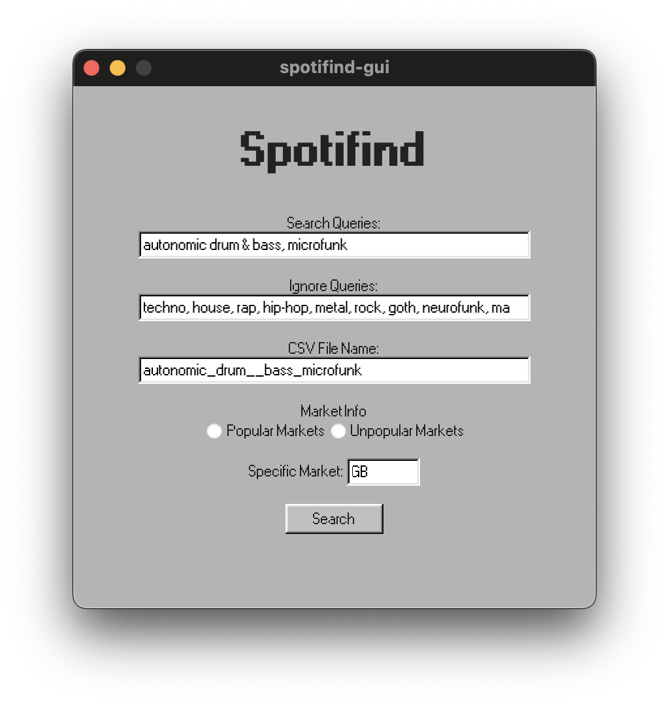
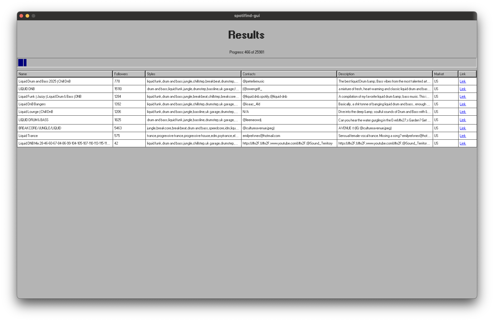

# Spotifind 🎧
Spotifind is an application designed to search Spotify playlists for contact info.

It extracts contact information and musical styles from playlists, providing a comprehensive overview of their content. It works similarly to paid services like PlaylistSupply and Distrokid's playlist engine but is free and open-source.

<figure>
    
</figure>

⚠️ Be aware that this project is in the early stages of development and sometimes may not work as expected.

And I know that writing cofings manually is pretty annoying, but at the moment it's not a priority, sorry.

## Features
- **Search Playlists**: Search for playlists based on specific criteria.
- **Extract Contacts**: Extract contact information from playlist descriptions.
- **Analyze Styles**: Analyze and categorize musical styles from playlists.

# Why is my antivirus blocking the app?
The application is not signed and is written in Go. There is a significant issue where the code, due to its use of Go runtime libraries, is mistakenly flagged by antivirus software as malware. Unfortunately, I can't do anything about this issue at the moment.

The code is open-source, so you can review it for yourself and/or build it yourself using my Makefile. If you're uncomfortable running the app, you can always use the library in your own projects.

# Step 1 - Installation
### Windows
1. Download the latest release for Windows from the [releases page](https://github.com/je09/spotifind-app/releases). The file name should be "spotifind-gui-windows.zip".
2. Extract the downloaded file to any location you prefer, such as your User folder, Documents folder, Desktop or any other place.
3. Create a new folder in your User folder and name it "spotifind". The path should look something like `'C:\Users\<username>\spotifind'`, where `<username>` is your username instead.
4. Download the "[spotifind.yml](https://raw.githubusercontent.com/je09/spotifind-app/refs/heads/main/spotifind-example.yml)" file and save it to the "spotifind" folder you created in the previous step. Ensure the file name is "spotifind.yml", it's important.
5. Open "spotifind.yml" with any text editor (for example, Notepad) by right-clicking on the file, selecting "Open with," and then choosing Notepad.
6. Set your `saveLocation`, which is the folder where all the scanned playlists will be saved. The recommended path for Windows is: `'C:\Users\<username>\Documents\Spotify Playlists'`, where `<username>` is your Windows username. Ensure that you include quotes around the path!
7. After making the changes, save the file but do not close it yet. You can proceed to step 2 now!

### macOS
1. Download the latest release for macOS from the [releases page](https://github.com/je09/spotifind-app/releases). Make sure the file name is something like "spotifind-gui-macos.zip".
2. Extract the downloaded file into your "Applications" folder.
3. Create a new folder in your User folder and name it "spotifind" or ".spotifind" if you prefer it to be hidden. The path should look something like `'/Users/<username>/spotifind'`, where `<username>` is your username instead.
4. Download and save the "[spotifind.yml](https://raw.githubusercontent.com/je09/spotifind-app/refs/heads/main/spotifind-example.yml)" file to the "spotifind" folder you created in the previous step. Ensure that the file name is "spotifind.yml".
5. Open the "spotifind.yml" file with any text editor (e.g., TextEdit) by right-clicking on the file and selecting "Open with" -> "TextEdit".
6. Set your `saveLocation`, which is the folder where all the scanned playlists will be saved. The recommended path for macOS is: `'/Users/<username>/Documents/Spotify Playlists'`, where `<username>` is your macOS username. Ensure that you include quotes around the path!
7. Great job! Save the file, but do not close it yet. You can proceed to step 2 now!

If macOS displays the message, "Spotifind.app is damaged and can't be opened. You should move it to the Bin," follow these steps:
1. Open "Terminal." You can do this by searching for it in Spotlight (press Command + Space and type "Terminal"), accessing it from your Launchpad, or finding it in the Applications folder under Utilities.
2. Once Terminal is open, enter the following command: `xattr -cr /Applications/Spotifind.app`. Make sure you have already copied "Spotifind" into the Applications folder. Hit enter and enjoy the feeling of being a real hacker from the movies!

# Step 2 - Getting Spotify API credentials
If you're not experienced user, the process of the configuration and usage of the Spotifind can be a bit tricky, but don't worry, I'll guide you through the process.
###### First, you need to set up your Spotify Developer account and create a new application to obtain your API credentials. This step is essential, as it allows Spotifind to communicate with the Spotify API and extract data from the playlists.
1. Go to the [Spotify Developer Dashboard](https://developer.spotify.com/dashboard/applications) and log in with your Spotify account (yes, it's safe—it's Spotify's official site).
2. Navigate to the dashboard by clicking on your username in the top right corner of the page.
3. Click the "Create an App" button.
4. Choose a name and description for your app that you're comfortable with. For the "Redirect URIs," enter `http://localhost:8080/callback` and then click the "Add" button next to it.
5. When asked, "Which API/SDKs are you planning to use?" select "Web API."
6. Read through the "Developers Terms of Service" and "Spotify Developer Terms of Service," and click "I understand..." if you agree to them.
7. Click "Save."
8. Great job! Now click on "Settings" on the right side of the page.
9. Click "View Client Secret" and then copy both the "Client ID" and "Client Secret" into the "spotifind.yml" file you set up in the first step, replacing the placeholders with your credentials.
10. Save the file, and you're all set!
11. You can include credentials from multiple applications, so if you encounter any issues, you can switch to another application.

**Important: Do not share your credentials with anyone, as this can lead to unauthorized access to your Spotify account!**

# Step 3 - Running the app
To open the app, double-click on the file "spotifind-gui-windows.exe" or "spotifind-gui-macos" that you downloaded and extracted in the first step.

Here are some instructions on how to use the app:
- **Search Queries:** Enter your search queries in the "Search Queries" field, separating each with a comma. This is similar to how you would type in the Spotify search bar.
- **Ignore Queries:** In the "Ignore Queries" field, input any strings you want to exclude from the playlist descriptions, names, and styles, also separated by commas. For example, if you are searching for "lofi ambient," you might want to ignore "rap, shoegaze, hip hop" to avoid playlists that contain those genres.
- **CSV File Name:** Specify the name of the file where the results will be saved in the "CSV File Name" field. The app sets a default name automatically, but you can change it if desired.
- **Market Info:** For market selection, it is recommended to choose "Popular" to search for playlists in the most popular markets. However, you can also select "Unpopular" or a specific country if you prefer. Keep in mind that "popularity" is subjective.
- **Search:** Click the "Search" button to initiate the search. The progress will be displayed in the "Progress" field. All found results will be saved in the CSV file you specified in the "CSV File Name" field, located in the folder selected in Step 1. Note that if you run the same search again, previous results will not be displayed, but they will still be saved in the CSV file.

- Enjoy!

<figure>
    
</figure>


# Use in your own projects
Spotifind is designed as a library, so you can use it in your own projects.
Todo so, you can use go get command:
```bash
go get github.com/je09/spotifind
```

Then you can import the library in your project:
```go
package main

import (
	"fmt"
	"github.com/je09/spotifind"
)

func main() {
	auth := spotifind.SpotifindAuth{
		ClientID:     "client_id",
		ClientSecret: "client_secret",
	}

	s, err := spotifind.NewSpotifind(auth, false)
	if err != nil {
		panic(err)
	}

	// ch - channel for search results
	ch := make(spotifind.SpotifindChan)

	// pCh - channel for progress of the scan
	pCh := make(spotifind.ProgressChan)

	// Search for playlists on popular markets
	go func() {
		err = s.SearchPlaylistPopular(
			ch,
			pCh,
			[]string{"liquidfunk", "autonomic", "microfunk"}, // your search queries, just like the ones you'd type in the Spotify search bar
			[]string{"techno", "metal", "punk"})              // ignore these strings in description and name of the playlist
		if err != nil {
			panic(err)
		}
	}()

	// Output the progress of the scan
	go func() {
		for progress := range pCh {
			fmt.Printf("Progress: %d out of %d\n", progress.Done, progress.Total)
		}
	}()

	// Output found playlists
	for playlist := range ch {
		fmt.Printf("Playlist: %s has contacts %v\n", playlist.Playlist.Name, playlist.Playlist.Contacts)
	}
}
```

### If you’d like to express your gratitude, you can simply [listen to my music on Spotify or any platform you prefer](https://syglit.xyz). It would mean a lot to me! Everything I do is driven by my passion for music. Thank you!

# Attention!
All the code in this repository is for educational purposes only. It is not intended for any other use, as such use may violate the terms of service of the Spotify API. Please refer to the current version of the Spotify API terms of service before using Spotifind.

## License

This project is licensed under the MIT License. See the `LICENSE` file for details.

## Acknowledgements

- [Spotify Web API](https://developer.spotify.com/documentation/web-api/)
