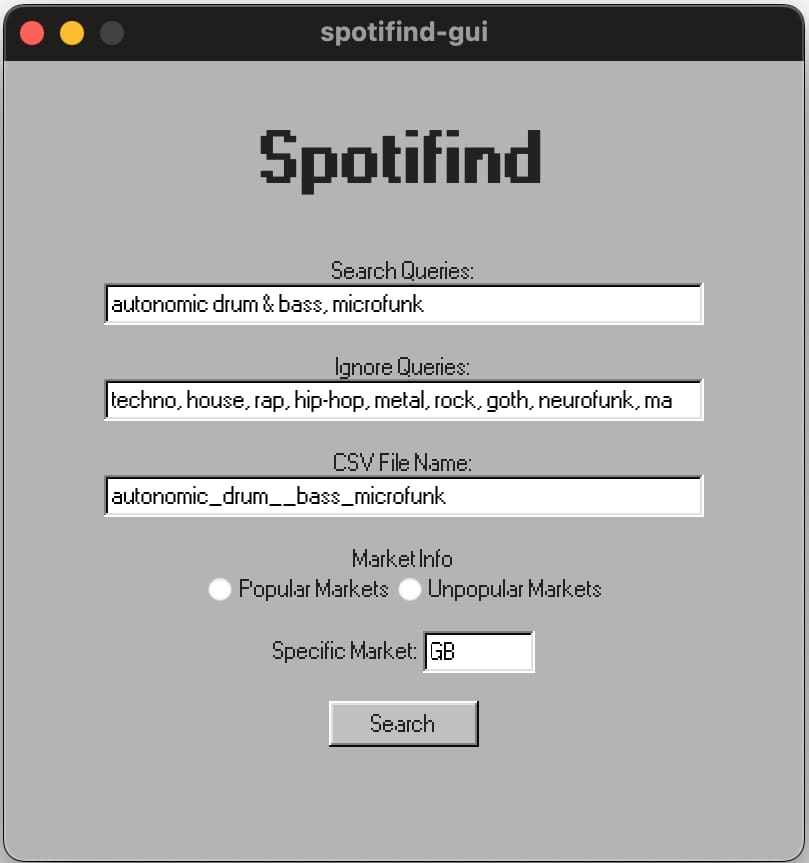
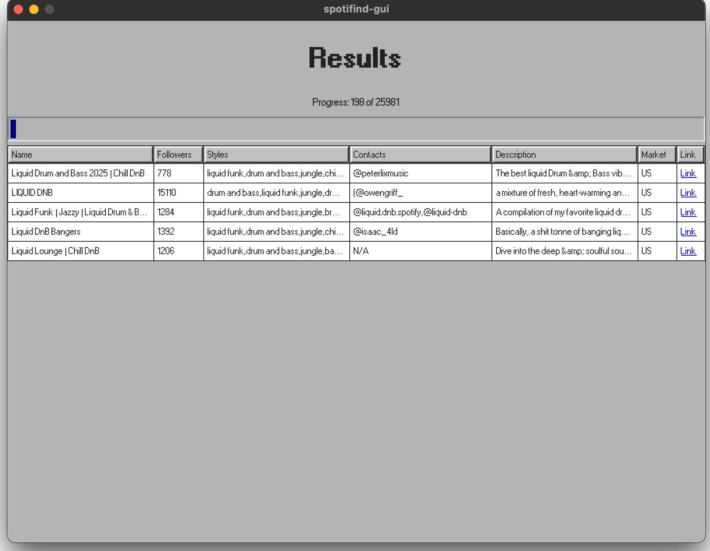

# Spotifind 🎧
Spotifind is a Go-based application designed to search Spotify playlists for contact info.
It extracts contact information and musical styles from playlists, providing a comprehensive overview of the playlists' content.
Works pretty similar to paid services like PlaylistSupply and Distrokid's playlist engine, but free and open-source.

<figure>
    
</figure>

⚠️ Be aware that this project is in the early stages of development and may not work as expected. And I know that writing cofings manually is pretty annoying, but at the moment it's not a priority, sorry.

## Features
- **Search Playlists**: Search for playlists based on specific criteria.
- **Extract Contacts**: Extract contact information from playlist descriptions.
- **Analyze Styles**: Analyze and categorize musical styles from playlists.

# Why my anti-virus software is blocking the app?
The app is not signed and it's Go. There's a huge problem with code written in Go false positives in anti-virus software. Anti-viruses tend to consider the Go-runtime libraries as a malware signature, which I can't do anything about at the moment.
The code is open-source, so you can check it yourself. If you're not comfortable with running the app, you can always use the library in your own projects.

# Step 1 - Installation
## GUI
### Windows
1. Download the latest release for Windows from the [releases page](https://github.com/je09/spotifind-app/releases) the name has to be "spotifind-gui-windows.exe.zip".
2. Extract the downloaded file anywhere you like (in your User's folder or Desktop).
3. Create a new folder in your User's folder and name it "spotifind".
3. Download and save "[spotyfind.yml](https://raw.githubusercontent.com/je09/spotifind-app/refs/heads/main/spotifind-example.yml)" file to the "spotifind" folder you created in the previous step. Check if the file name is "spotifind.yml".
4. Open the "spotifind.yml" with any text editor (Notepad for example) - (Left-click on the file -> Open with -> Notepad).
5. Set your saveLocation (it's a folder where all the scanned playlists will be saved), recommended path for Windows is - 'C:/Users/<username>/Documents/Spotify Playlists', where <username> is your Windows username. Make sure, that there are quotes around the path!
4. Well done, save your file, but do not close it yet. You can go to the step 2 now!

### macOS
1. Download the latest release for Windows from the [releases page](https://github.com/je09/spotifind-app/releases) the name has to be "spotifind-gui-macos.zip".
2. Extract the downloaded file to your "Applications" folder.
3. Create a new folder in your User's folder and name it "spotifind" or ".spotifind" if you don't want it to be visible.
3. Download and save "[spotyfind.yml](https://raw.githubusercontent.com/je09/spotifind-app/refs/heads/main/spotifind-example.yml)" file to the "spotifind" folder you created in the previous step. Check if the file name is "spotifind.yml".
4. Open the "spotifind.yml" with any text editor (TextEdit for example) - (Left-click on the file -> Open with -> TextEdit).
4. Well done, save your file, but do not close it yet. You can go to the step 2 now!

# Step 2 - Getting Spotify API credentials
If you're not experienced user, the process of the configuration and usage of the Spotifind can be a bit tricky, but don't worry, I'll guide you through the process.
###### First of all, you need to setup your Spotify Developer account and create a new application to get your API credentials. *it needs to be done so spotifind can communicate with SpotifyAPI and therefore extract the data from the playlists.*.
1. Go to [Spotify Developer Dashboard](https://developer.spotify.com/dashboard/applications) and log in with your Spotify account (yes, it's safe, it's Spotify's site after all).
2. Then go to the dashboard (click on your username on the top right angle of the page).
3. Click on the "Create an App" button.
4. Choose any "App name" and "App description" you're comfortable with. For the "Redirect URIs" you can put `http://localhost:8080/callback` and then click "Add" button, which is just in the same line.
5. To answer "Which API/SDKs are you planning to use?" simply choose "Web API".
6. Read the "Developers Terms of Service" and "Spotify Developer Terms of Service" and click "I understand..." if you agree with them.
7. Click "Save".
8. Cool, you're doing great! Now click "Settings" on the right side of the page.
9. Click "View Client Secret" and then copy both "Client ID" and "Client Secret" to the "spotyfind.yml" file we set up on the first step. Simply replace the placeholders with your credentials.
10. Save the file and you're ready to go!
11. You may include credentials from multiple applications, so if you encounter any issues, you can switch to another application. Note, that this is not intended use and can violate the Spotify API terms of service.
**Note, do not share your credentials with anyone, as it can lead to the unauthorized access to your Spotify account!**

# Step 3 - Running the app
You can open the app by double-clicking on the "spotifind-gui-windows.exe" or "spotifind-gui-macos" file you downloaded and extracted in the first step.
Here are some notes on how to use the app:
- Place your search queries in the "Search Queries" field, separated by commas. This is the same as you'd type in the Spotify search bar.
- Place your ignore queries in the "Ignore Queries" field, separated by commas. These are the strings that will be ignored in the description, name and styles of playlists. For example, if you're looking for "lofi ambient", you can ignore "rap,shoegaze, hip hop" to avoid playlists that contain these styles.
- In the "CSV File Name" field, you can set the name of the file where the results will be saved. The sets automatically, but if you wish, you can change it.
- For the market info - recommended option is to choose "Popular" as it will search for playlists in the most popular markets, but you can choose "Unpopular" or a specific country if you wish. Note, that "popularity" is strongly subjective.
- Click "Search" button to start the search. The progress will be displayed in the "Progress" field. All the found results will be saved in the CSV file you specified in the "CSV File Name" field in the folder you specified on Step 1. Note that the next time you run the same search, the previous results won't be displayed, but they will be saved in the CSV file.
- Enjoy!

<figure>
    
</figure>


# Use in your own projects
Spotifind is designed as a library, so you can use it in your own projects.
Todo so, you can use go get command:
```bash
go get github.com/je09/spotifind
```

Then you can import the library in your project:
```go
package main

import (
	"fmt"
	"github.com/je09/spotifind"
)

func main() {
	auth := spotifind.SpotifindAuth{
		ClientID:     "client_id",
		ClientSecret: "client_secret",
	}

	s, err := spotifind.NewSpotifind(auth, false)
	if err != nil {
		panic(err)
	}

	// ch - channel for search results
	ch := make(spotifind.SpotifindChan)

	// pCh - channel for progress of the scan
	pCh := make(spotifind.ProgressChan)

	// Search for playlists on popular markets
	go func() {
		err = s.SearchPlaylistPopular(
			ch,
			pCh,
			[]string{"liquidfunk", "autonomic", "microfunk"}, // your search queries, just like the ones you'd type in the Spotify search bar
			[]string{"techno", "metal", "punk"})              // ignore these strings in description and name of the playlist
		if err != nil {
			panic(err)
		}
	}()

	// Output the progress of the scan
	go func() {
		for progress := range pCh {
			fmt.Printf("Progress: %d out of %d\n", progress.Done, progress.Total)
		}
	}()

	// Output found playlists
	for playlist := range ch {
		fmt.Printf("Playlist: %s has contacts %v\n", playlist.Playlist.Name, playlist.Playlist.Contacts)
	}
}
```

### If you want to say thank you somehow, simply [listen to my music on Spotify or anywhere you like](https://syglit.xyz), it would mean a lot to me! Everything I do is because of the passion for the music I have! Thank you!

# Attention!
All the code in this repository is for educational purposes only.
It is not intended to be used for any other purpose, as it can violate the terms of service of the Spotify API.
Please consult current version of the Spotify API terms of service before using the Spotifind.

## License

This project is licensed under the MIT License. See the `LICENSE` file for details.

## Acknowledgements

- [Spotify Web API](https://developer.spotify.com/documentation/web-api/)
